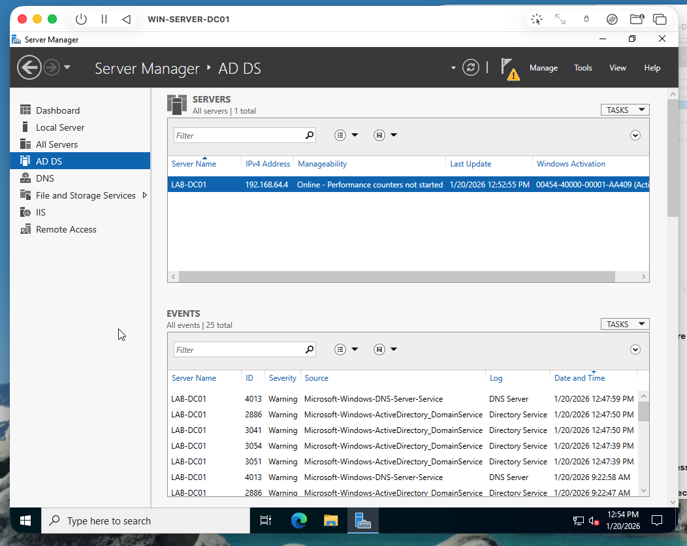
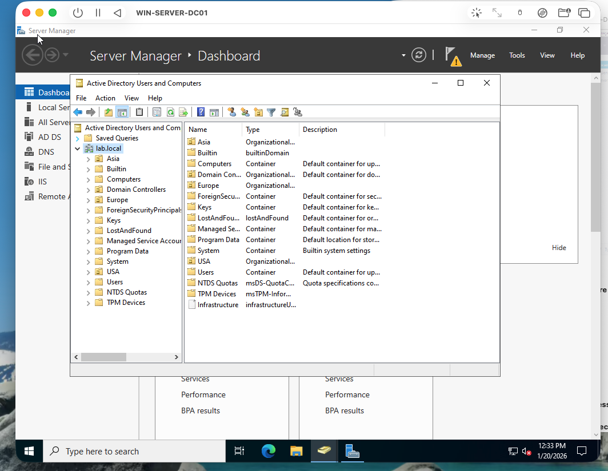
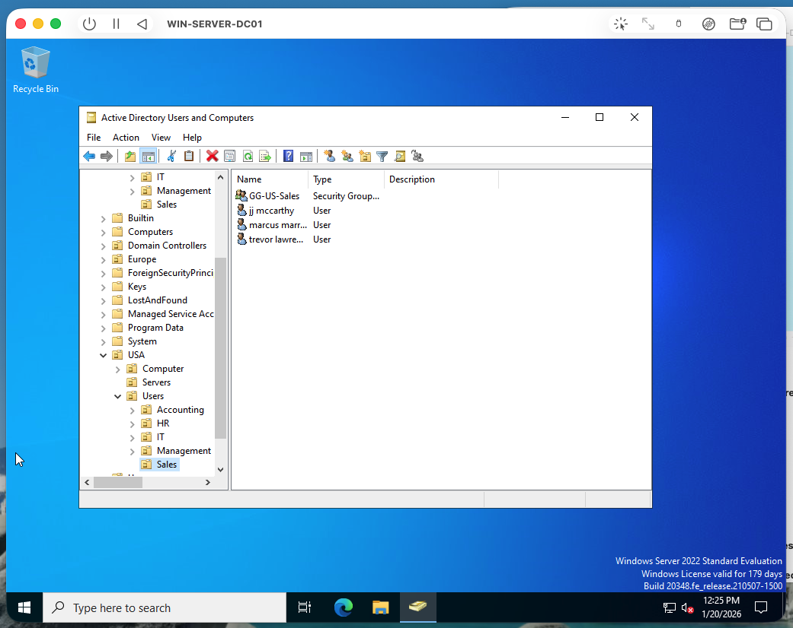
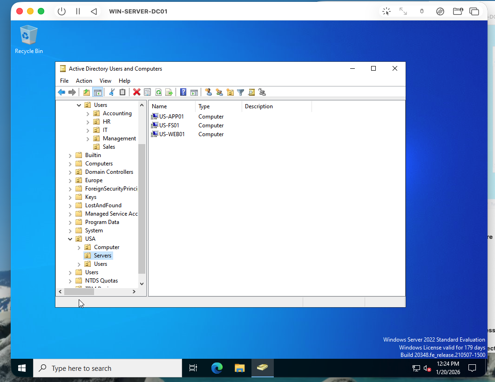
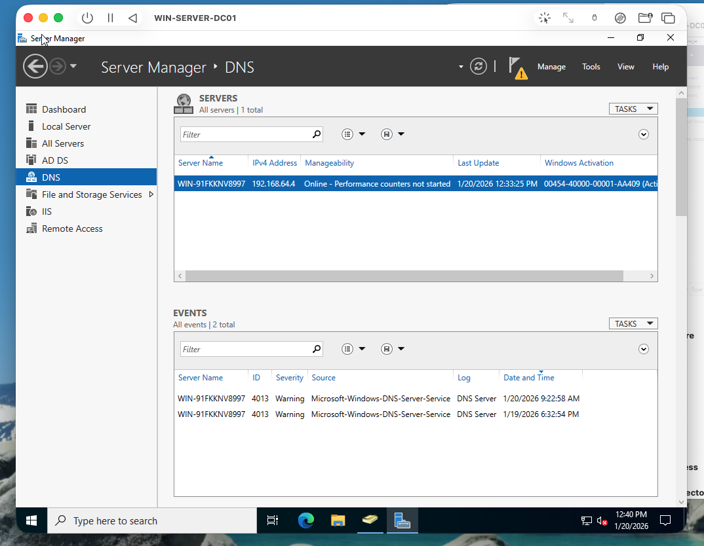
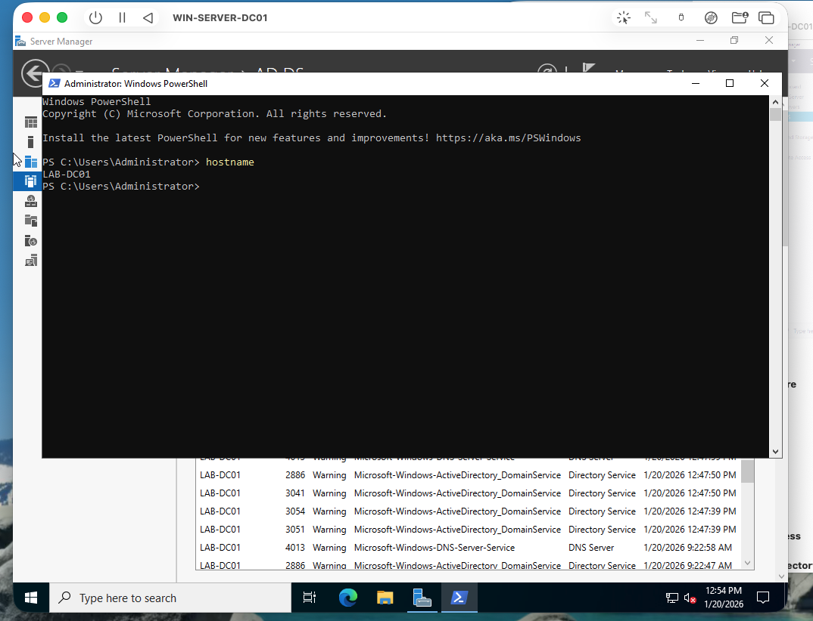

# Active Directory Home Lab — Windows Server 2022

## Overview

Built a Windows Server 2022 domain controller from scratch and designed an enterprise-scale Active Directory structure with multi-region OUs, departmental access groupings, and least-privilege object organization. Configured AD DS and DNS roles, provisioned users, security groups, and computer objects across USA, Europe, and Asia regions, and verified the full domain configuration via PowerShell and Server Manager.

## Objective

Deploy a functional Windows domain and implement a scalable OU structure that enforces least-privilege access control across enterprise user, group, and computer objects.

## Tools Used

- Windows Server 2022
- Active Directory Domain Services (AD DS)
- DNS Server role
- Active Directory Users and Computers (ADUC)
- PowerShell
- Server Manager

## What I Did

- Installed Windows Server 2022 and promoted it to Domain Controller with AD DS and DNS roles
- Renamed the server to `LAB-DC01` and verified hostname via PowerShell
- Designed a three-region OU hierarchy: USA, Europe, Asia
- Created departmental sub-OUs within each region: IT, HR, Accounting, Sales, Management
- Provisioned user accounts and security groups organized by department
- Created computer and server objects using an enterprise-consistent naming convention
- Confirmed all roles active and healthy through Server Manager dashboards

## Evidence / Findings

**Domain Controller promotion confirmed**

Server Manager confirms AD DS and DNS roles installed and running on LAB-DC01.

**Multi-region OU structure**

ADUC view showing USA, Europe, and Asia OUs with departmental sub-OUs nested within each region.

**Users and security groups**

User accounts and security groups populated per department, structured for role-based access control.

**Computer objects**

Computer objects created with a consistent naming convention across regions.

**DNS role confirmation**

DNS Server role confirmed active — domain name resolution operational.

**Hostname verification**

PowerShell output confirming server hostname matches the domain controller designation.

## Outcome / Recommendations

The domain is fully functional and structured for least-privilege administration. The OU hierarchy isolates administrative scope by region and department, enabling Group Policy Objects (GPOs) to be applied at a granular level without over-permissioning. Next steps would include implementing GPOs for password policy enforcement, account lockout thresholds, and privileged account restrictions — controls directly relevant to reducing lateral movement and privilege escalation risk in enterprise environments.
