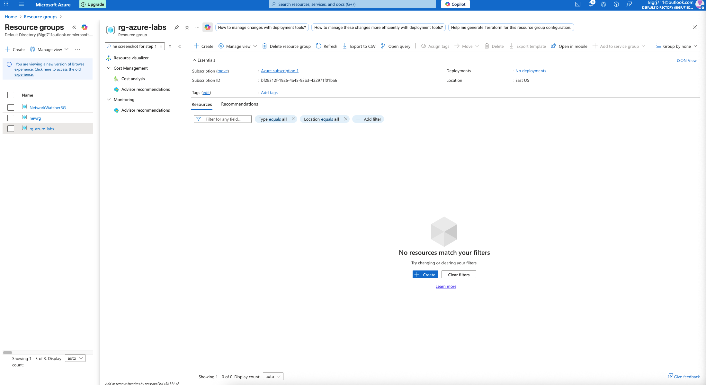
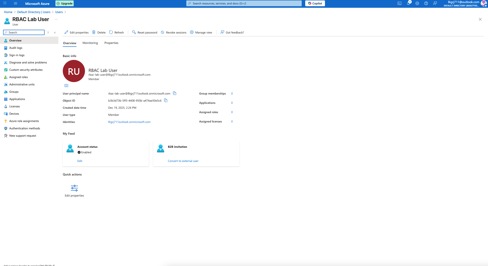
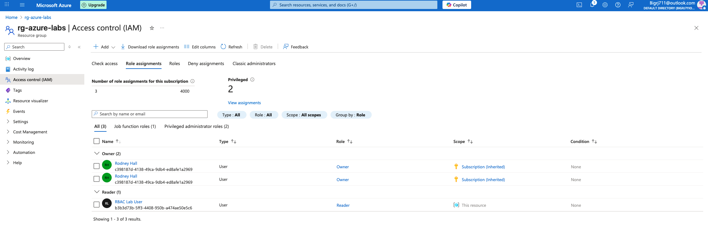
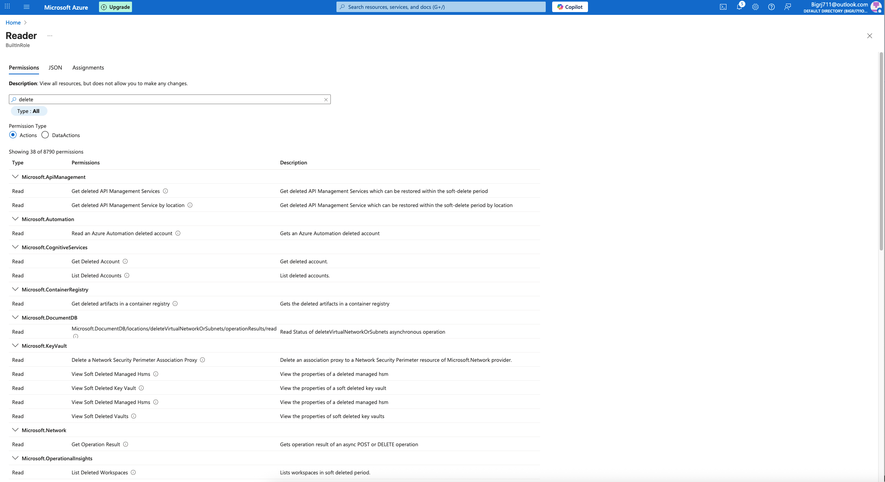

# Azure Cloud Security Labs

Hands-on Azure cloud security labs demonstrating identity, access control, and least-privilege enforcement.

---

## Lab 01 — Azure RBAC: Least Privilege

### Objective
Validate Azure Role-Based Access Control (RBAC) by restricting user permissions and confirming denied access.

---

### Resource Group Created

---

### User Created

---

### Reader Role Assigned

---

### Access Denied Proof

---

## Key Takeaways
- Least privilege prevents unauthorized resource modification
- RBAC enforcement is verifiable through access denial
- Screenshots provide audit-ready evidence

