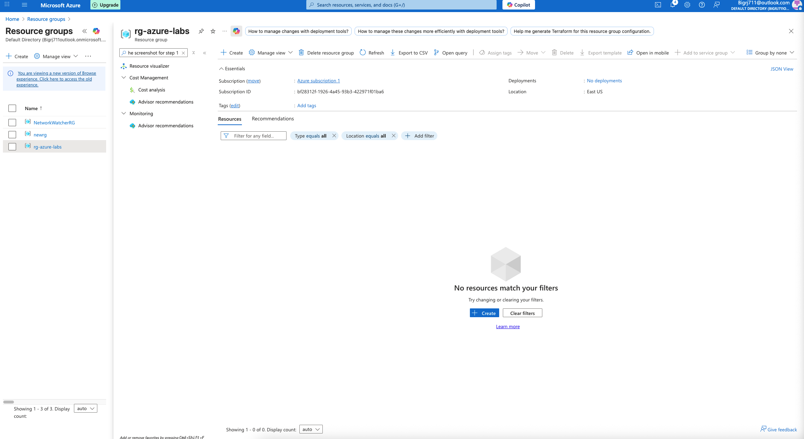
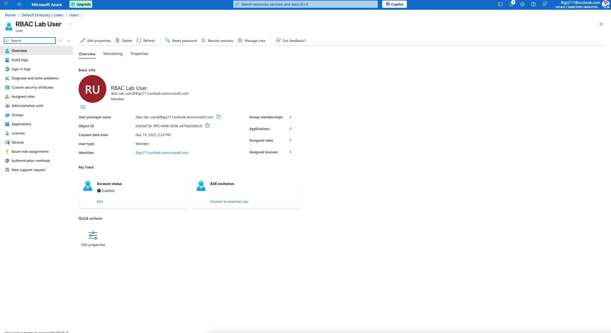
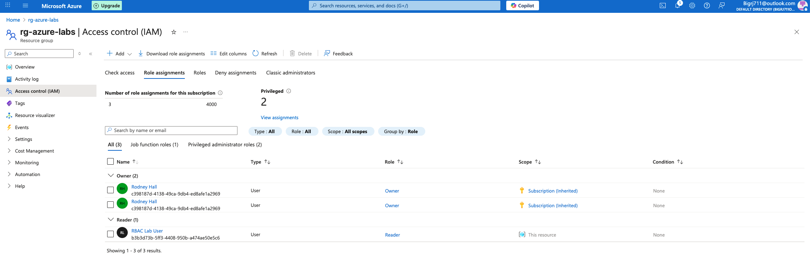
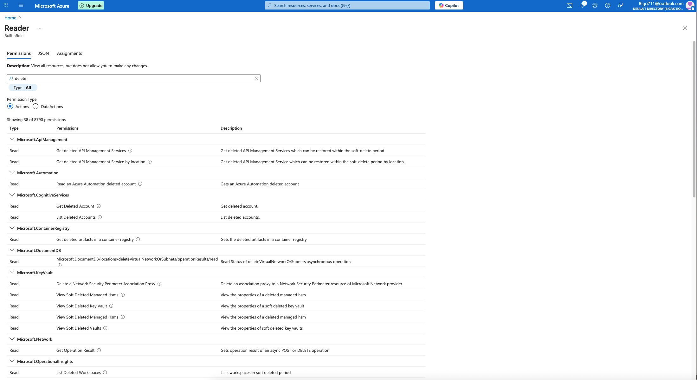

# Azure Cloud Security — RBAC & Least Privilege

## Overview

Configured Azure Role-Based Access Control (RBAC) and Microsoft Entra ID to enforce least-privilege access on a scoped Azure resource group. Created a test user, assigned a Reader role restricted to a single resource group, and validated enforcement by confirming write operations were denied. Every step is documented with audit-ready screenshots proving the full IAM control chain.

## Objective

Validate that Azure RBAC correctly enforces least-privilege access by restricting a user to read-only permissions and confirming denied write access through live testing.

## Tools Used

- Microsoft Azure Portal
- Microsoft Entra ID (Azure AD)
- Azure Role-Based Access Control (RBAC)

## What I Did

- Created a dedicated resource group to establish a scoped permission boundary
- Provisioned a test user in Microsoft Entra ID with no default role assignments
- Assigned the Reader role to the test user, scoped to the target resource group only
- Authenticated to the Azure portal as the test user
- Attempted a write operation on the resource group to test enforcement
- Captured and documented the access denial as audit evidence

## Evidence / Findings

**Resource group created**

Resource group provisioned in Azure portal — establishes the permission scope boundary for the RBAC assignment.

**Test user created**

Test user provisioned in Entra ID with no elevated roles — confirms the starting state before role assignment.

**Reader role assigned**

Reader role assigned to the test user, scoped to the resource group — confirms least-privilege configuration applied.

**Access denied — write operation rejected**

Write attempt by the Reader-scoped user returns an access denial — confirms RBAC enforcement is functioning as configured.

## Outcome / Recommendations

RBAC enforcement validated end-to-end. The test user was correctly prevented from performing write operations outside the granted scope, confirming that least-privilege principles are enforced at the Azure control plane level. This configuration pattern applies directly to production IAM hygiene: scope role assignments to the minimum required resource, validate enforcement after assignment, and document evidence for audit and compliance reviews. Regularly audit role assignments in Entra ID to identify privilege creep and excessive permissions granted over time.
