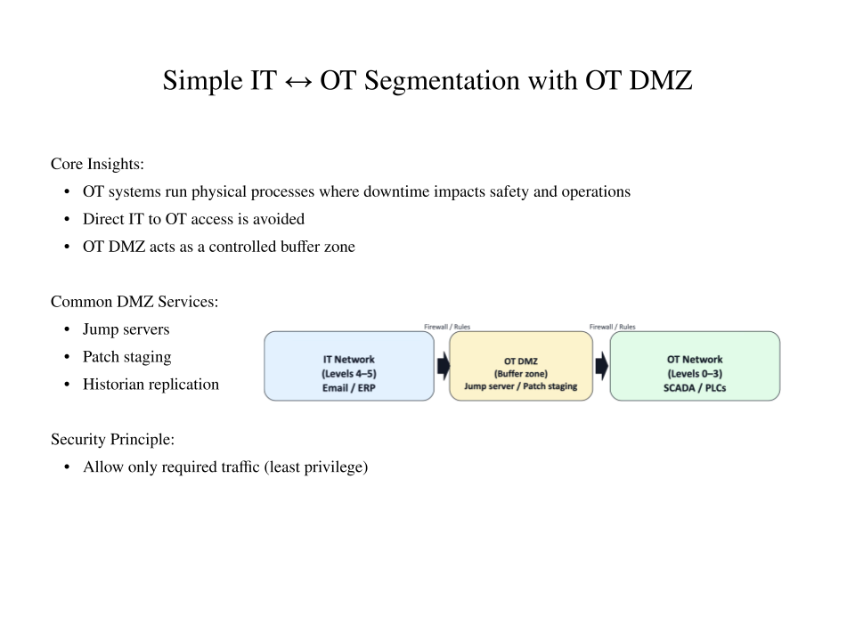
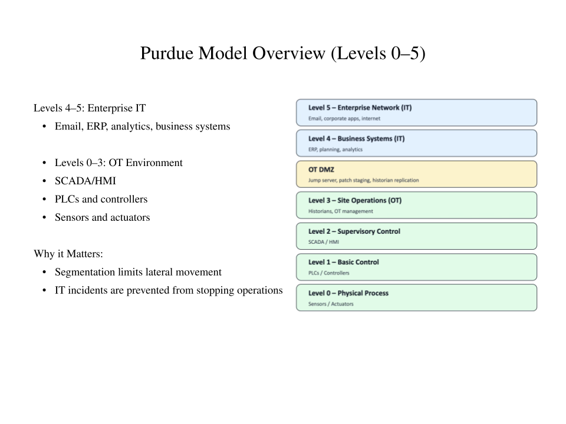

# OT/ICS Foundations Mini-Lab
**Purdue Model + IT/OT Segmentation**

## Overview
This mini-lab demonstrates foundational understanding of OT/ICS network segmentation using the Purdue Model and an OT DMZ. The focus is on protecting operational availability and safety by limiting direct IT-to-OT access.

## What This Lab Covers
- IT vs OT priorities (business systems vs physical processes)
- OT DMZ as a controlled buffer zone
- Purdue Model Levels 0–5
- Segmentation to reduce lateral movement and operational impact

## Diagrams
### Simple IT ↔ OT Segmentation with OT DMZ

### Purdue Model (Levels 0–5)

## Status
Foundations / In Progress – built as a reference and learning artifact.
