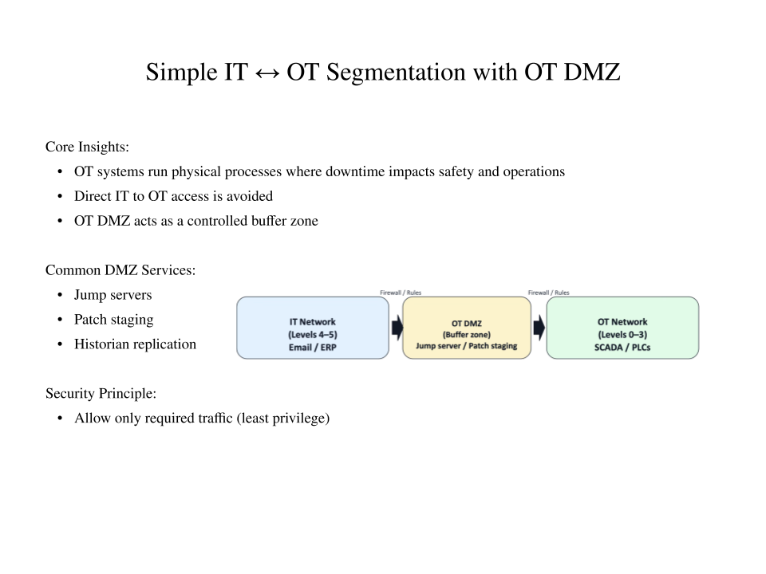
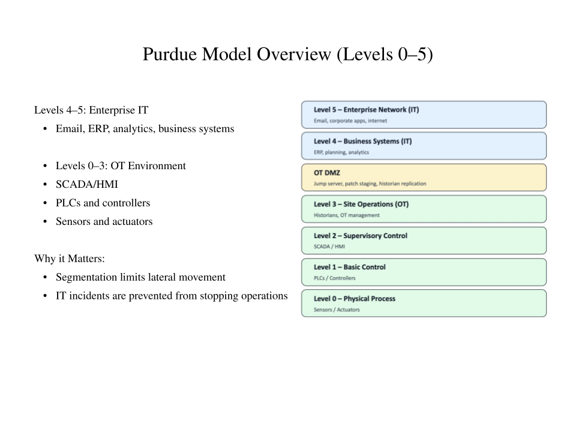

# OT/ICS Foundations — Purdue Model & IT/OT Segmentation

## Overview

Designed IT/OT network segmentation architecture using the Purdue Model, documented an OT DMZ topology to isolate operational systems from enterprise IT, and produced an analyst-facing incident evidence checklist for OT environment triage. Diagrams map all five Purdue Model levels to corresponding asset types, segmentation boundaries, and security considerations — providing a reference architecture for defensive design in industrial environments.

## Objective

Model a defensible OT network architecture and produce operational documentation to support analyst triage and escalation in environments where operational continuity and safety take priority over rapid containment.

## Tools Used

- Network architecture diagramming
- Purdue Model framework
- ICS incident response documentation practices

## What I Did

- Mapped IT and OT network zones to Purdue Model Levels 0–5 with corresponding asset types at each level
- Designed an IT/OT DMZ topology to serve as a controlled buffer between enterprise systems (Levels 3–5) and operational networks (Levels 0–2)
- Documented the security rationale for each segmentation boundary and identified lateral movement paths the architecture controls
- Identified which communication flows require cross-boundary inspection and which should be blocked by default
- Built a structured incident evidence checklist covering initial triage, asset identification, network review, indicators of concern, and escalation steps — tailored to OT analyst priorities

## Evidence / Findings

**IT/OT segmentation diagram**

Architecture diagram showing the OT DMZ positioned as a controlled buffer between enterprise IT and operational technology networks. Segmentation boundaries limit direct IT-to-OT communication and contain potential lateral movement.

**Purdue Model diagram**

Purdue Model mapped across all five levels — Level 0 (field devices) through Level 4/5 (enterprise/internet). Each level annotated with asset types, communication protocols, and segmentation requirements.

**OT Incident Evidence Checklist**
Structured triage document covering: environment confirmation, impacted Purdue level identification, asset identification, network and access review, indicators of concern, and escalation procedures. Available at [evidence-checklist.md](evidence-checklist.md).

## Outcome / Recommendations

The segmentation architecture demonstrates defensible design principles for OT environments — separating safety-critical operational systems from enterprise IT while maintaining controlled data historian and remote access paths through the DMZ. The evidence checklist provides analysts with a repeatable process to document, scope, and escalate OT incidents while preserving operational safety.

Key architecture recommendations for production environments:

- Enforce default-deny firewall policies at all IT/OT segmentation boundaries
- Route all historian and SCADA-to-IT communication through the DMZ with inspection
- Restrict remote access to OT networks through jump servers in the DMZ — no direct inbound connections to OT segments
- Apply Purdue Model level tagging to all OT assets in the asset inventory to enable level-aware incident scoping
