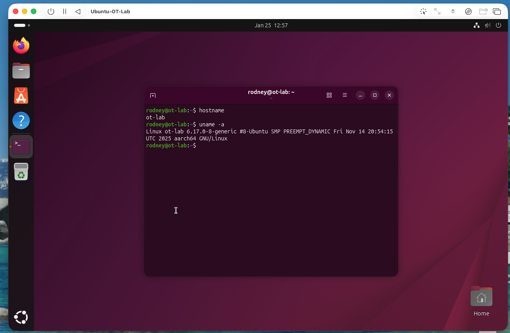
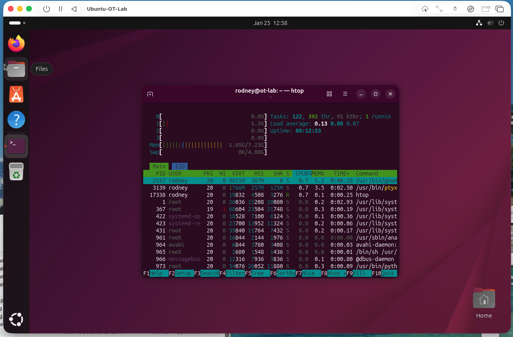
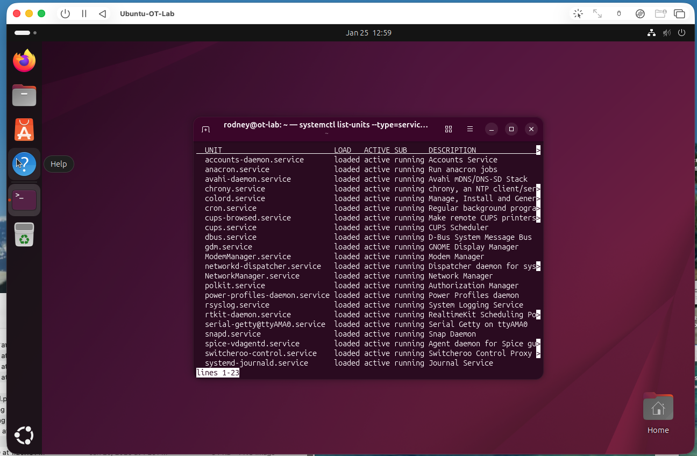
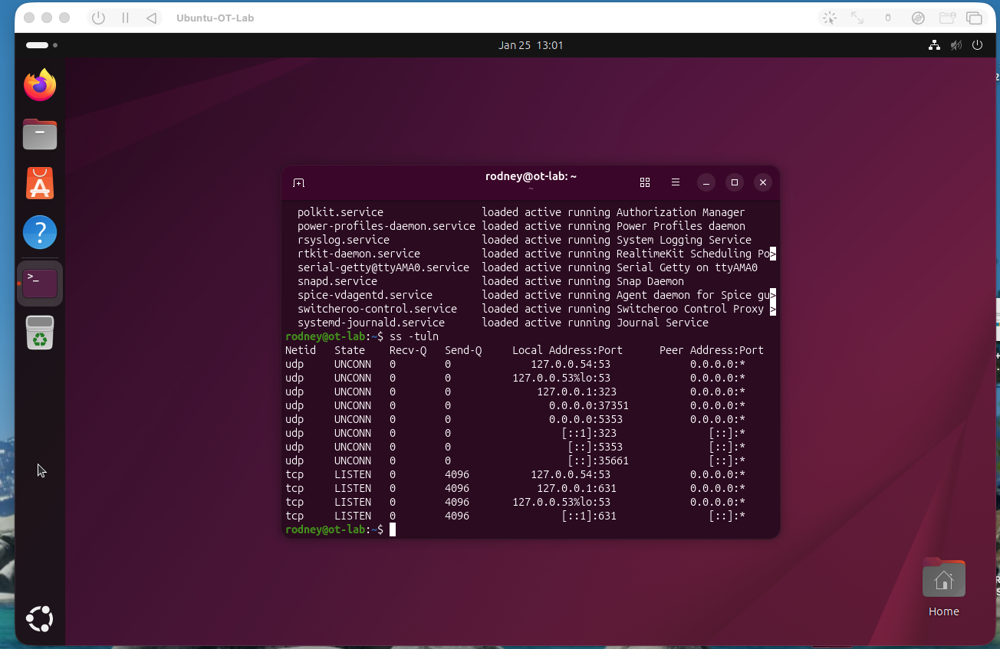
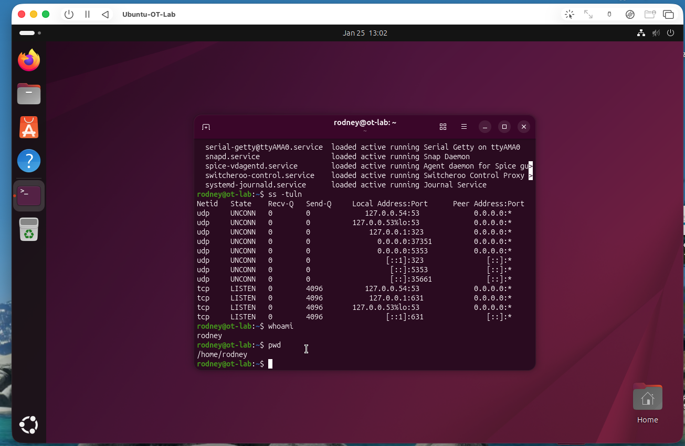
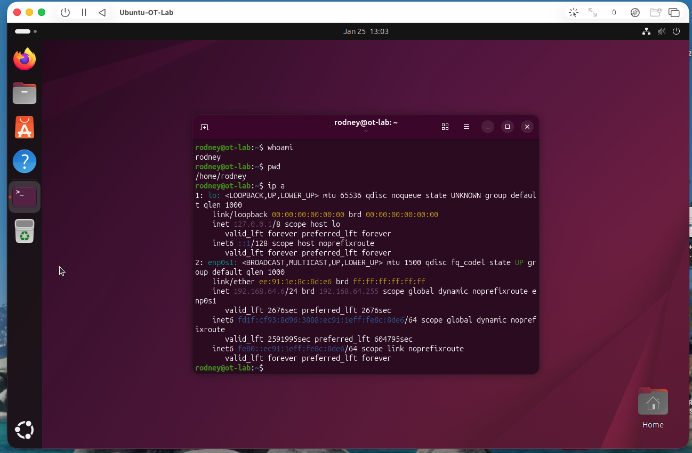

← [Back to Portfolio](https://rodney-hall.github.io/cybersecurity-portfolio/)

# Linux System Baseline — OT Environment

## Overview

Established a secure operational baseline for a Linux system in an OT-adjacent environment using passive, non-intrusive inspection methods. Verified system identity, enumerated all running services and listening network ports, and mapped active network interfaces — producing a documented reference state for change detection. All inspection methods were selected to avoid disrupting system availability or triggering service interruptions in the operational environment.

## Objective

Conduct a passive baseline audit of an OT-adjacent Linux system to establish a documented reference state for services, network exposure, and system health — without impacting availability or triggering process disruption.

## Environment

- Platform: Ubuntu Linux (ARM64) — UTM/QEMU
- Hostname: `ot-lab`
- Role: OT-adjacent Linux system under availability-first security constraints

## Tools Used

- bash / terminal
- `hostnamectl`, `uname` — system identity
- `htop` — resource utilization monitoring
- `systemctl` — service enumeration
- `ss` — passive socket and port inspection
- `ip` / network interface commands

## What I Did

- Verified hostname and confirmed system identity as `ot-lab` to anchor all documentation
- Captured OS version and kernel information to establish the baseline software state
- Monitored CPU and memory utilization with `htop` to document normal resource consumption at rest
- Enumerated all active services via `systemctl` and identified the expected service footprint
- Listed all listening network ports using passive socket inspection — no active scanning performed
- Reviewed active network interfaces to map system connectivity and identify connected network segments
- Captured screenshots of each inspection step to produce a reproducible baseline record

## Evidence / Findings

**System identity confirmed**

Hostname verified as `ot-lab`. OS version and kernel captured — establishes documentation anchor for all baseline records.

**Resource utilization baseline**

CPU and memory utilization captured at rest via `htop`. Establishes normal resource consumption — deviations from this baseline may indicate unauthorized processes.

**Active services enumerated**

Full service list captured via `systemctl` — documents the expected service footprint. Any new entries on a future baseline comparison represent an unauthorized service addition.

**Listening ports documented**

All listening ports identified via passive socket inspection. Documents the system's current network exposure — unexpected open ports on future review indicate configuration drift or unauthorized software.

**Terminal context**

Terminal session context confirming execution environment and analyst access level.

**Network interfaces mapped**

Active network interfaces listed with IP addressing — documents which segments the system is connected to and confirms the network topology assumed in the baseline.

## Outcome / Recommendations

Baseline established for the `ot-lab` system. The documented service list, port exposure profile, and resource utilization provide the reference state needed to detect unauthorized changes, new services, or unexpected network connections on future audits.

- Store baseline snapshots in a version-controlled security runbook and re-run on a defined cadence
- Diff service lists and listening port output against the baseline after any maintenance window
- Flag any new services, open ports, or interface changes as change control items requiring review
- Integrate baseline outputs into SIEM as reference data for endpoint behavioral baselining
