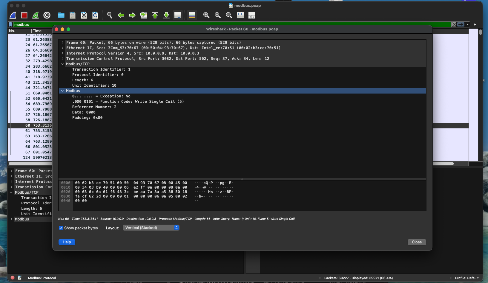
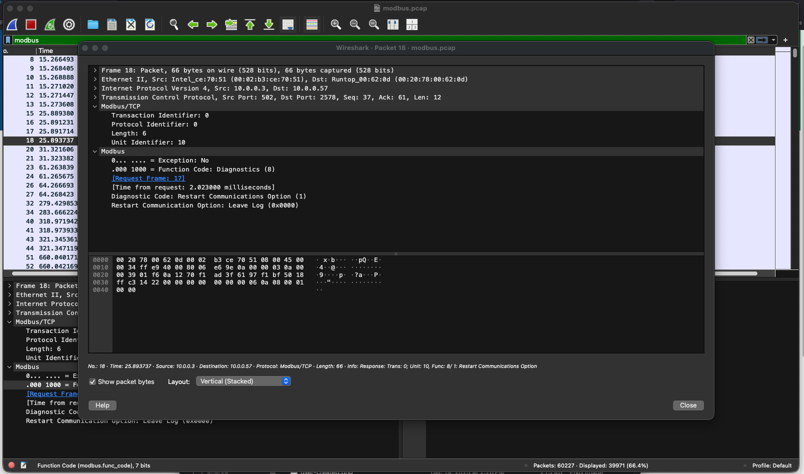
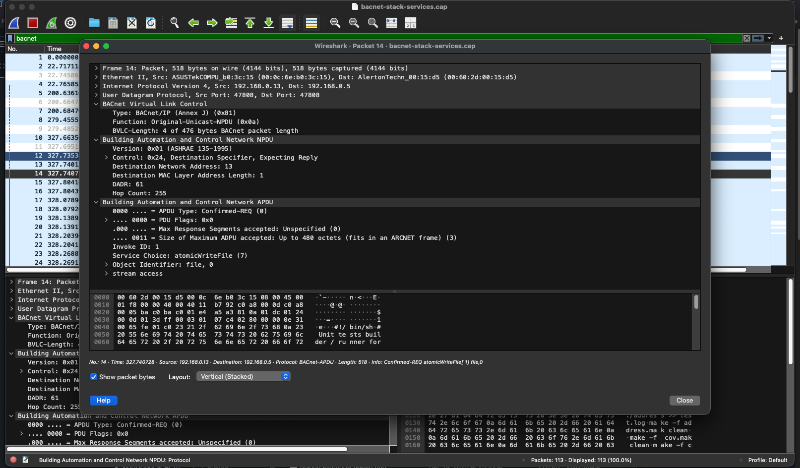
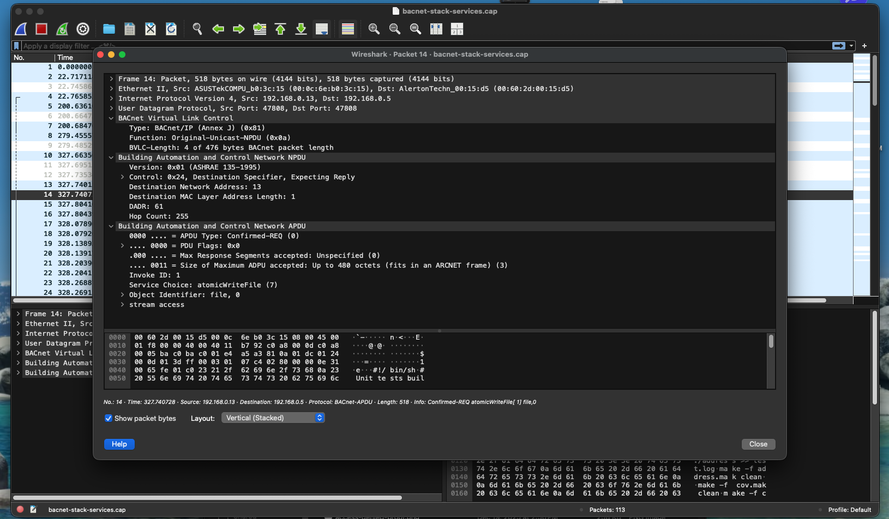

# OT Network Threat Detection & Incident Analysis

## Overview

Analyzed OT network traffic for indicators of unauthorized control activity and active reconnaissance. Identified Modbus/TCP function codes consistent with write operations issued without any authentication exchange, and flagged BACnet broadcast traffic exhibiting device enumeration patterns inconsistent with normal polling behavior. Documented IOCs across both protocols and produced findings and escalation recommendations aligned to ICS incident response procedures.

## Objective

Detect and document anomalous OT protocol activity in captured network traffic and produce a written incident analysis with escalation rationale and mitigation recommendations.

## Tools Used

- Wireshark
- PCAP files (BACnet, Modbus/TCP)

## What I Did

- Analyzed Modbus/TCP traffic and identified control-oriented function codes with the potential to alter device register state
- Documented cleartext Modbus command execution preceded by no authentication challenge — confirming unauthenticated write access
- Correlated request-response pairs to confirm the commands were accepted and executed by the target device
- Analyzed BACnet traffic for elevated Who-Is broadcast volume and timing inconsistent with normal polling intervals
- Identified I-Am responses confirming device enumeration was successful — attacker-visible inventory of addressable devices
- Assessed combined findings across both protocols to evaluate overall threat posture
- Documented all IOCs and produced a structured incident analysis with escalation rationale

## Evidence / Findings

**Modbus — suspicious control command**

Modbus frame showing a write-class function code issued to a target device. No authentication exchange precedes the command — the device accepted the instruction without verifying the source.

**Modbus — request/response correlation**

Corresponding response frame confirms the write command was executed. Unauthenticated control of device state confirmed.

**BACnet — active device enumeration**

Who-Is broadcast traffic captured at volume and timing inconsistent with normal device polling — consistent with active device discovery by an unauthorized source.

**BACnet — enumeration confirmed**

I-Am responses confirm target devices responded to the discovery traffic, providing the source with an addressable device inventory.

## Outcome / Recommendations

The observed activity meets the escalation threshold for a monitored OT environment. Unauthenticated write commands combined with active reconnaissance behavior represents a credible risk to device availability and operational safety. While no destructive outcome was confirmed in the captured traffic, the conditions exist for an unauthorized actor to alter device state or map the OT network without detection.

**Recommended actions:**

- Implement passive OT network monitoring with alert rules for write-class Modbus function codes (FC 5, 6, 15, 16) from unapproved source IPs
- Establish baselines for normal BACnet polling intervals and trigger alerts on Who-Is broadcast volume deviation
- Restrict Modbus write access to approved engineering workstation IPs via firewall ACLs
- Segment the OT network to limit broadcast domain scope and contain reconnaissance exposure
- Escalate any confirmed write commands from unrecognized sources to OT security operations for immediate review
