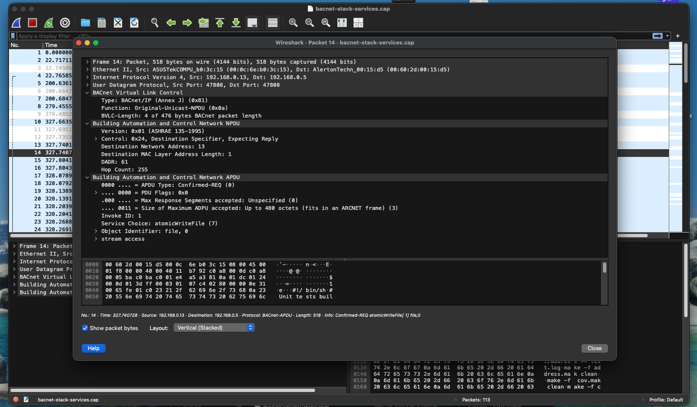
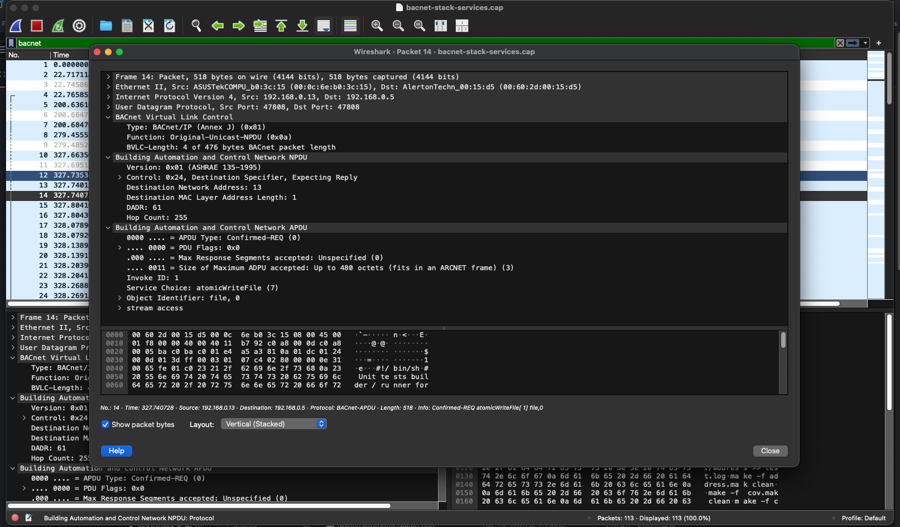
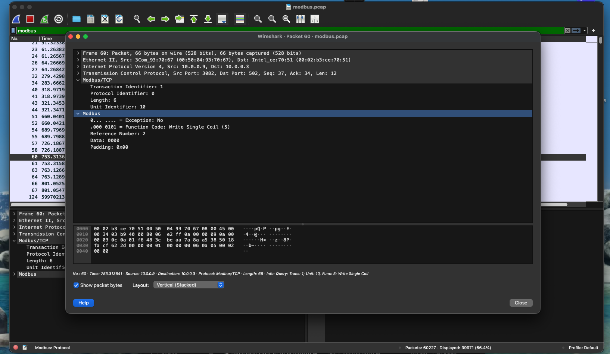
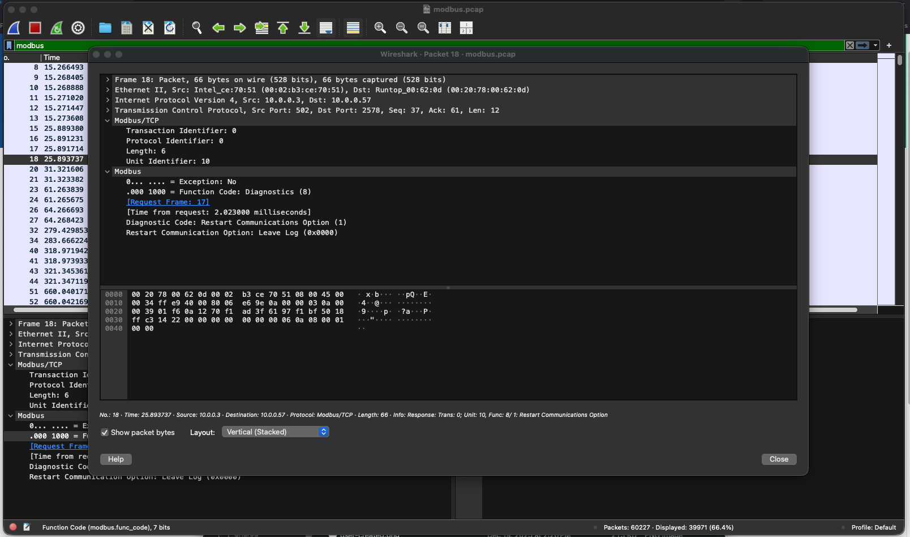

# OT Network Threat Detection & Incident Analysis

## Overview
This project simulates the detection and analysis of suspicious activity in an Operational Technology (OT) network. Using Wireshark and OT protocol traffic, the lab focuses on identifying behavior that could indicate unauthorized control, misconfiguration, or malicious activity in industrial control system (ICS) environments.

## Objective
- Establish a baseline understanding of normal OT network behavior
- Identify anomalous or risky OT protocol activity
- Document findings using an incident-analysis mindset

## Tools Used
- Wireshark
- OT protocol PCAP files (BACnet, Modbus/TCP)

## Detection Scenarios Analyzed

### Scenario 1: Suspicious Modbus Control Activity
During analysis of Modbus/TCP traffic, control-related function codes were observed that could impact device behavior if issued by an unauthorized source.

**Why this matters in OT**
- Modbus lacks authentication and encryption
- Write or diagnostic functions can alter device state
- Unauthorized commands pose availability and safety risks

**Indicators observed**
- Control-oriented Modbus function codes
- Clear-text request/response communication
- Command execution without authentication

---

### Scenario 2: BACnet Device Discovery Abuse
BACnet broadcast traffic was analyzed to identify excessive or unexpected device discovery activity.

**Why this matters in OT**
- BACnet discovery reveals device presence and metadata
- Repeated discovery may indicate reconnaissance
- OT environments prioritize stability and minimal traffic

**Indicators observed**
- Broadcast Who-Is / I-Am messages
- Device enumeration behavior
- Lack of access control at the protocol level

## Evidence

### BACnet — Suspicious Write / Control Behavior

### BACnet — Device Discovery / Reconnaissance

### Modbus — Suspicious Control Command

### Modbus — Request / Response Correlation

---

## Incident Analysis Summary
Based on the observed traffic, the activity would warrant escalation in a monitored OT environment. While no destructive behavior was confirmed, the lack of authentication and visibility into command intent presents a risk to system availability and safety.

## Recommended Actions
- Monitor OT protocol traffic for control-oriented commands
- Establish baselines for normal polling and discovery behavior
- Restrict OT network access through segmentation and firewall rules
- Escalate suspicious control activity for further investigation

## Status
Initial threat detection analysis complete.
