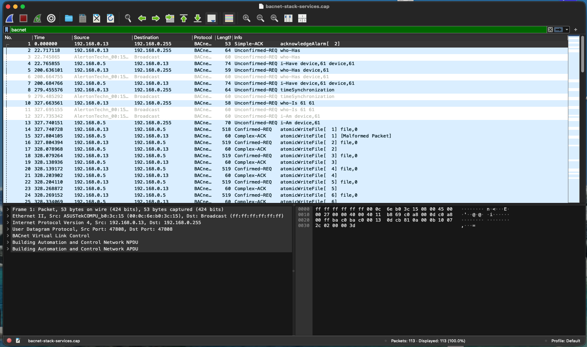
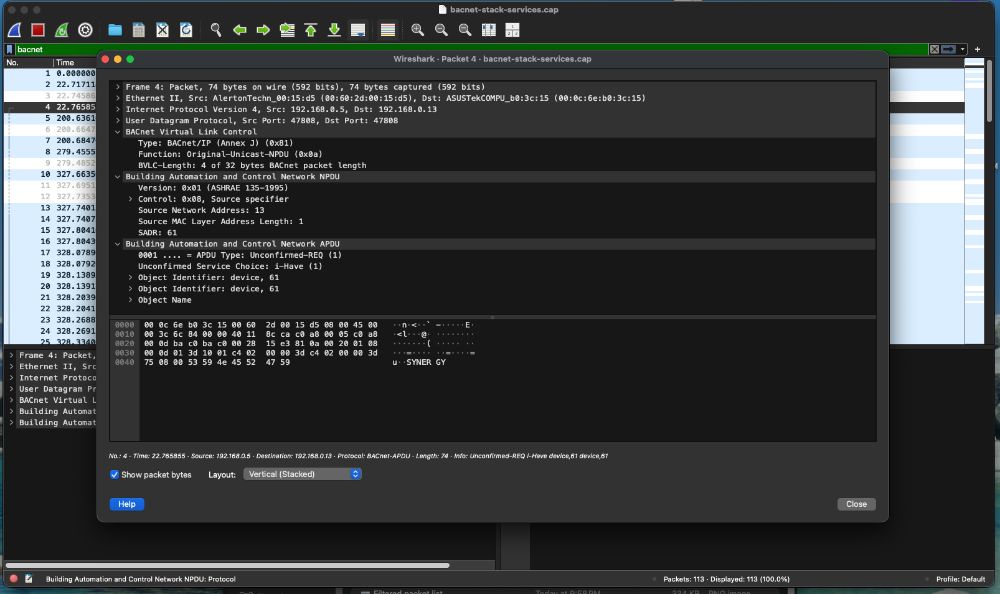
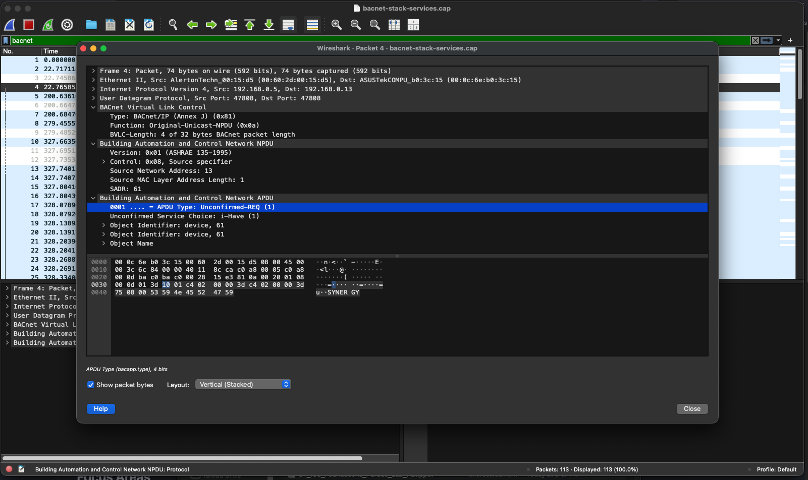

# OT Network Traffic Analysis (Wireshark)

Hands-on analysis of Operational Technology (OT) and Industrial Control System (ICS) network traffic using Wireshark. This project focuses on identifying device discovery behavior, control messages, and protocol-level communication patterns commonly found in industrial environments.

---

## Tools Used
- Wireshark
- Sample OT/ICS PCAP files

---

## Protocols Analyzed
- **BACnet** (Building Automation and Control Networks)
- **Modbus/TCP** (Industrial Control Systems)

---

## Analysis Performed
- Applied protocol-specific display filters in Wireshark  
- Identified broadcast-based device discovery traffic (Who-Is / I-Am)  
- Expanded and interpreted NPDU and APDU fields  
- Observed Modbus request/response patterns and function codes  
- Documented unencrypted OT protocol behavior

---

## Evidence

### BACnet Analysis

**Filtered BACnet traffic**  

**NPDU / APDU expansion**  

**APDU / NPDU breakdown**  

### Modbus/TCP Analysis

**Filtered Modbus traffic**  

**Function code inspection**  

**Request / response correlation**  

