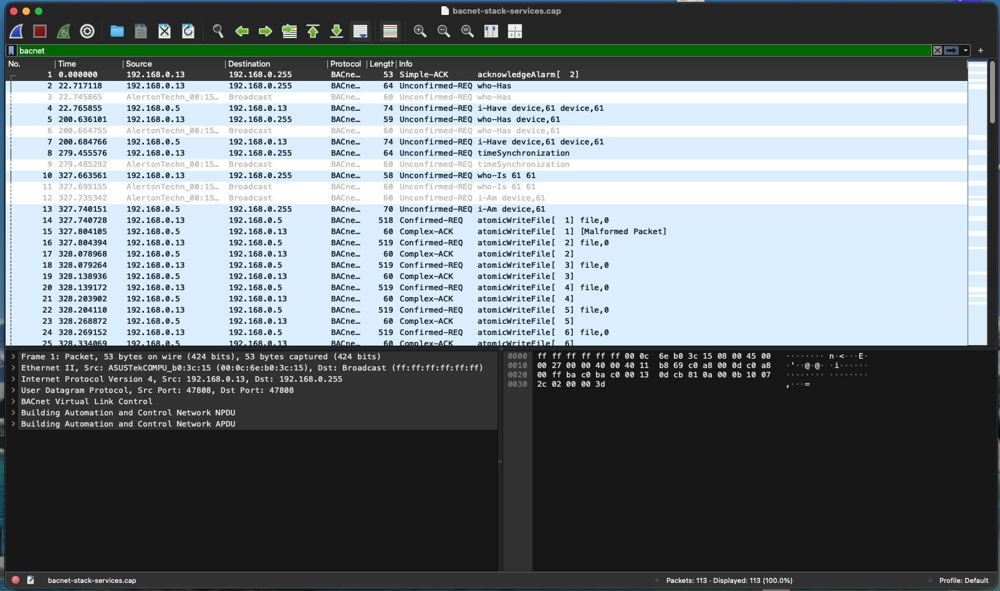
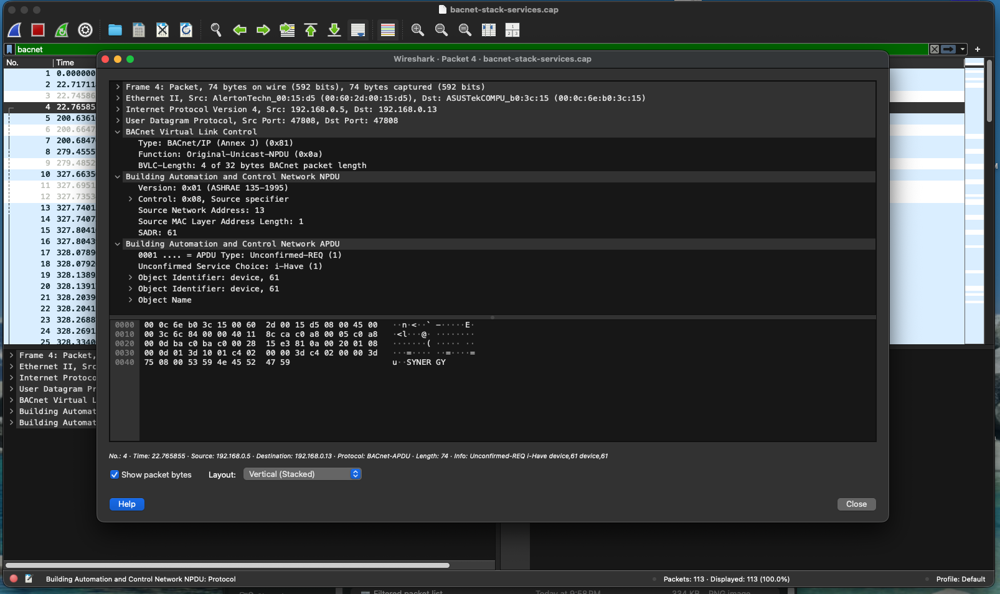
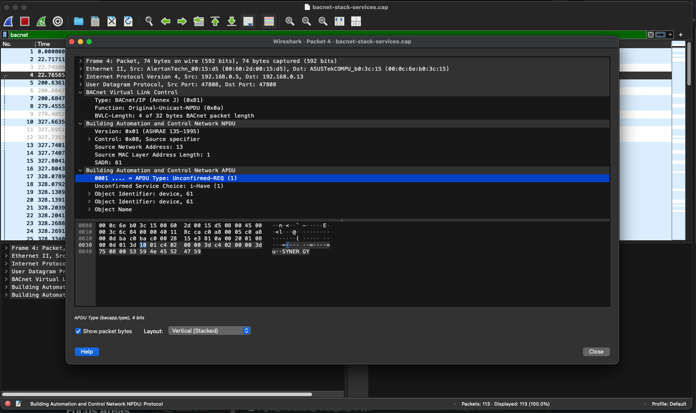
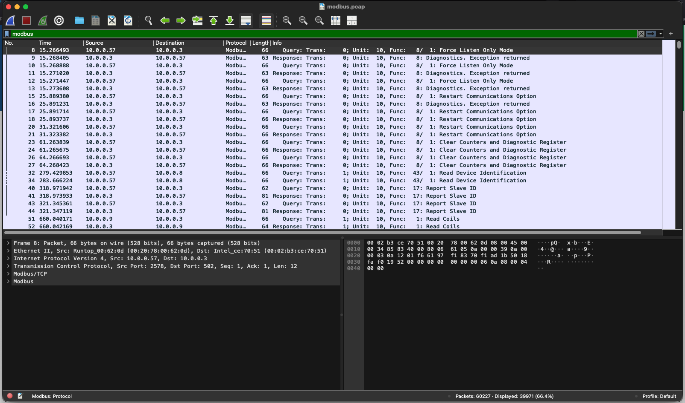
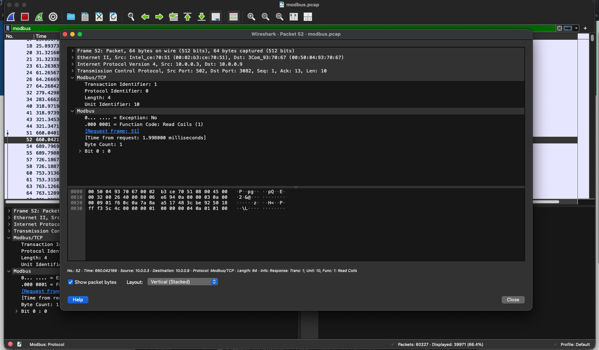

← [Back to Portfolio](https://rodney-hall.github.io/cybersecurity-portfolio/)

# Network Traffic Analysis — Wireshark / PCAP

## Overview

Analyzed BACnet and Modbus/TCP network traffic using Wireshark to characterize OT protocol behavior and establish communication baselines. Applied protocol-specific display filters, decoded NPDU and APDU packet structures, and correlated Modbus request-response sequences across captured traffic. Findings confirm that both protocols transmit device commands and operational data in cleartext with no authentication — creating a high-value target for passive monitoring and anomaly detection.

## Objective

Perform passive PCAP analysis of OT network traffic to characterize protocol behavior, document device communication patterns, and produce findings applicable to detection rule development and network baselining.

## Tools Used

- Wireshark
- PCAP files (BACnet, Modbus/TCP)

## What I Did

- Opened OT protocol PCAP files and applied Wireshark display filters to isolate BACnet and Modbus/TCP traffic
- Identified BACnet Who-Is broadcast traffic used for device discovery across the network segment
- Captured I-Am response messages confirming active device enumeration
- Expanded NPDU and APDU fields to inspect BACnet packet structure and message content at each protocol layer
- Filtered Modbus/TCP traffic on port 502 and identified function codes across request and response frames
- Correlated Modbus request-response pairs to validate which commands were accepted and executed
- Documented all findings with annotated screenshots for use in baselining and detection rule development

## Evidence / Findings

**BACnet display filter applied**

Wireshark filter `bacnet` isolates BACnet protocol traffic — Who-Is broadcasts visible as broadcast destination frames, confirming device discovery behavior.

**NPDU and APDU layers expanded**

BACnet packet structure expanded to show NPDU (network layer) and APDU (application layer) fields — message type, device addressing, and service parameters visible in cleartext.

**BACnet frame breakdown**

Layer-by-layer breakdown of a BACnet frame confirming no encryption or authentication fields present at any layer.

**Modbus/TCP display filter applied**

Wireshark filter isolates Modbus traffic on TCP port 502 — request and response frames separated and visible for correlation.

**Modbus protocol expanded**

Modbus frame expanded showing function code, register address, and data values — all transmitted in cleartext with no authentication header.

**Request-response correlation**

Modbus request and corresponding response correlated — confirms command was accepted and executed by the target device with no authentication challenge.

## Outcome / Recommendations

Both BACnet and Modbus/TCP operate without encryption or authentication. A passive network tap on either protocol segment provides complete visibility into device inventory, communication patterns, and command execution — with no credentials required. This creates both a detection opportunity and a significant risk exposure:

- Deploy passive OT network sensors to capture and baseline BACnet and Modbus traffic — any deviation from the established baseline is an actionable alert
- Implement detection rules for write-class Modbus function codes (FC 5, 6, 15, 16) from unapproved source IPs
- Alert on BACnet Who-Is broadcast volume exceeding normal polling intervals
- Restrict Modbus write access to approved engineering workstation IPs at the network layer
